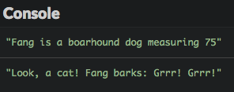

# Introducere în JavaScript

## **Istoricul JavaScript**

JavaScript este în primul rând limbajul de programare a web-ului. A fost inventat în 1995 de către Brendan Eich , care în acel moment a lucrat pentru Netscape , compania care a creat primul browser web popular (strămoșul lui Firefox).

Un browser este software-ul pe care îl utilizați pentru a accesa pagini Web și a utiliza aplicații web.

JavaScript nu ar trebui să fie confundat cu Java, un alt limbaj de porgramare inventat în același timp! Ambele au o sintaxă similară, dar cazurile lor de utilizare și "filosofia" sunt foarte diferite.

Ideea din spatele JavaScript a fost aceea de a crea un limbaj simplu pentru a face paginile web dinamice și interactive, deoarece paginile la acel momenterau foarte simple.


Constructorii web au început să îmbogățească treptat paginile prin adăugarea codului JavaScript. Pentru ca acest cod să funcționeze, browserul web al destinatarului (software-ul folosit pentru a naviga pe web) a trebuit să poată procesa JavaScript. Acest limbaj a fost integrat progresiv în browsere, iar acum toate browserele sunt capabile să îl gestioneze!

Din cauza exploziei de pe Web și a apariției web 2.0 (bazată pe pagini bogate, interactive), JavaScript a devenit din ce în ce mai popular. Designerii browser-ului web au optimizat viteza de executare a JavaScript-ului, ceea ce înseamnă că acum este un limbaj foarte rapid.

Acest lucru a dus la apariția platformei Node.js , care vă permite să creați aplicații JavaScript în afara browserului. Datorită unui software numit MongoDB , JavaScript a intrat chiar în lumea bazei de date (software-ul al cărui rol este de a stoca informații).

În cele din urmă, popularitatea smartphone-urilor și tabletelor cu sisteme diferite (iOS, Android, Windows Phone) a dus la apariția așa-numitelor instrumente de dezvoltare cross-platform. Acestea vă permit să scrieți o singură aplicație mobilă compatibilă cu aceste sisteme. Aceste instrumente sunt aproape întotdeauna bazate pe ... JavaScript!

## **JavaScript: un limbaj esențial**

Pe scurt, JavaScript este peste tot. Se află pe lângă un ecosistem bogat de componente (bucăți mici de software pe care le puteți conecta cu ușurință în proiectul dvs.) și o comunitate vibrantă de dezvoltatori. Știind că va deschide ușile programării pe partea de browser web (cunoscută sub numele de dezvoltarea front-end), dezvoltarea de servere (back-end) și dezvoltarea mobilă. Un număr tot mai mare de persoane văd JavaScript ca cea mai importantă tehnologie în dezvoltarea de software din zilele noastre.

Atât omniprezent și încă relativ ușor de învățat, JavaScript este, de asemenea, o alegere excelentă pentru învățarea unui limbaj de programare.

## **Versiunea utilizată în această carte**

JavaScript a fost standardizat în 1997 sub numele de ECMAScript . De atunci, limbajul a suferit mai multe etape de îmbunătățiri pentru a remedia unele incomodități și a susține noi caracteristici.


Această carte utilizează cea mai recentă versiune standardizată a JavaScript, numită ES2015 sau uneori ES6 . Această versiune aduce o mulțime de noutăți interesante "pe masă". Acum este bine susținută de cele mai multe medii și platforme, pornind de la browserele web (mai multe detalii în acest tabel de compatibilitate ).

# Variabilele

Acum știți cum să utilizați JavaScript pentru a afișa valorile. Cu toate acestea, pentru ca un program să fie cu adevărat util, acesta trebuie să poată stoca date, cum ar fi informațiile introduse de un utilizator. Să verificăm asta.

## **Rolul unei variabile**

Un program de calculator stochează date utilizând variabile. O variabilă este o zonă de stocare a informațiilor. Ne putem imagina ca o cutie în care poți pune si stoca lucruri!

## **Proprietățile variabilelor**

O variabilă are trei proprietăți principale:

* **Numele **ei, care o identifică. Numele unei variabile poate conține litere mari și mici, numere (nu în prima poziție) și caractere precum semnul dolarului ($) sau bară jos (_).

* **Valoarea **sa, care este informația stocată în variabilă.

* **Tipul **său, care determină rolul și acțiunile disponibile / aplicabile pentru variabilă.

În JavaScript nu trebuiesc definite explicit tipurile de variabile. Tipul său este dedus din valoarea stocată în variabilă și se poate schimba în timp ce programul rulează. De aceea spunem că JavaScript este un** limbaj scris dinamic**. Alte limbaje, cum ar fi C sau Java, necesită întotdeauna definirea tipurilor de variabile. Aceasta se numește **scriere statică **.

## **Declararea unei variabile**

Înainte de a putea stoca informații într-o variabilă, trebuie să o creați! Crearea ei se numește declararea unei variabile. Declararea unei variabile înseamnă că calculatorul își rezervă memorie în care să stocheze variabila. Programul poate citi sau scrie date în această zonă de memorie prin manipularea variabilei.

Iată un exemplu de cod care declară o variabilă și afișează conținutul acesteia:

```javascript
  
    let a;
console.log(a);
  
```


În JavaScript, declarați o variabilă cu cuvântul cheie **let** urmat de numele variabilei. În acest exemplu, este apelată variabila creată a.

În versiunile anterioare ale limbii, variabilele au fost declarate folosind cuvântul cheie var.

Iată rezultatul execuției pentru acest program.


Rețineți că rezultatul este **undefined**. Acesta este un tip special al JavaScript care nu indică nicio valoare. Am declarat variabila, numind-o a, dar nu i-am dat o valoare!

## **Atribuiți valori variabilelor**

În timpul funcționării unui program, valoarea stocată într-o variabilă se poate schimba. Pentru a da o nouă valoare unei variabile, utilizați operatorul **=** denumit operatorul de atribuire .

Consultați exemplul de mai jos:

```javascript
  
    let a;
a = 3.14;
console.log(a);
  
```


Am modificat variabila atribuindu-i o valoare. a = 3.14 se citește ca "a primește valoarea 3.14".

Aveți grijă să nu confundați operatorul de asignare, atribuire = cu egalitate matematică! În curând veți vedea cum să exprimați egalitatea în JavaScript.

De asemenea, puteți combina declararea unei variabile și atribuirea unei valori într-o singură linie. Doar conștientizați că, în această linie, faceți două lucruri simultan:

```javascript
  
    let a = 3.14;
console.log(a);
  
```


## **Declarând o variabilă constantă**

Dacă valoarea inițială a unei variabile nu se va schimba niciodată pe toată durata execuției programului, această variabilă este numită constantă . Această constanță poate fi impusă prin utilizarea cuvântului cheie **const **în loc de **let **în declararea acesteia. Astfel, programul este mai expresiv și încercările ulterioare de a modifica variabila pot fi detectate ca erori.

```javascript
  
    const a = 3.14; // The value of a cannot be modified
a = 6.28;       // Impossible!
  
```


## **Incrementează o variabilă de tip număr**

De asemenea, puteți mări sau micșora valoarea unui număr cu += și ++. Acesta din urmă este numit operator de incrementare, deoarece permite incrementarea (creșterea cu 1) a valorii unei variabile.

În exemplul următor, liniile 2 și 3 măresc fiecare valoarea variabilei b cu 1.

```javascript
  
    let b = 0;      // b contains 0
b += 1;         // b contains 1
b++;            // b contains 2
console.log(b); // Shows 2
  
```


## **Domeniu de aplicare al unei variabile**

Domeniul de aplicare al unei variabile este acea parte a programului în care variabila este vizibilă și utilizabilă. Variabilele declarate cu **let **sau **const **sunt **block-scoped**: vizibilitatea acestora este limitată la blocul în care sunt declarate (și la fiecare sub-bloc, dacă există). În JavaScript și multe alte limbaje de programare, un bloc de cod este o porțiune a unui program delimitat de o pereche de acolade de deschidere și închidere. Implicit, un program JavaScript formează un bloc de cod.

```javascript
  
    let nb1 = 0;
{
  nb1 = 1; // OK : nb1 is declared in the parent block
  const nb2 = 0;
}
console.log(nb1); // OK : nb1 is declared in the current block
console.log(nb2); // Error! nb2 is not visible here
  
```


# Expresii

O expresie este o bucată de cod care produce o valoare. O expresie este creată prin combinarea variabilelor, valorilor și operatorilor. Fiecare expresie are o valoare și deci un tip. Calcularea valorii unei expresii se numește evaluare. În cursul evaluării, variabilele sunt înlocuite cu valorile lor.

```javascript
  
    // 3 is an expression whose value is 3
const c = 3;
// c is an expression whose value is the value of c (3 here)
let d = c;
// (d + 1) is an expression whose value is d's + 1 (4 here)
d = d + 1; // d now contains the value 4
console.log(d); // Show 4
  
```


Prioritatea operatorilor în interiorul unei expresii este aceeași ca în matematică. Cu toate acestea, o expresie poate integra paranteze care modifică aceste priorități.

```javascript
  
    let e = 3 + 2 * 4; // e contains 11 (3 + 8)
e = (3 + 2) * 4;   // e contains 20 (5 * 4)
  
```


Este posibil să includeți expresii într-un șir folosind **backticks **(`) pentru a delimita șirul. Un astfel de șir este numit un șablon literal . În interiorul unui șablon literal, expresiile sunt identificate de sintaxa ${expresie}.

Acest lucru este adesea folosit pentru a crea șiruri care conțin valorile unor variabile.

```javascript
  
    const country = "France";
console.log(`I live in ${country}`); // Show "I live in France"
const x = 3;
const y = 7;
console.log(`${x} + ${y} = ${x + y}`); // Show "3 + 7 = 10"
  
```


## **Conversia tipului variabilelor, expresiilor**

Evaluarea unei expresii poate avea ca rezultat conversii de tip. Acestea se numesc conversii implicite, deoarece se întâmplă automat fără intervenția programatorului. De exemplu, folosirea operatorului + într-un șir și un număr determină concatenarea celor două valori într-un rezultat de șir.

```javascript
  
    const f = 100;
// Show "Variable f contains the value 100"
console.log("Variable f contains the value " + f);
  
```


JavaScript este extrem de tolerant în ceea ce privește conversia de tip. Cu toate acestea, uneori conversia nu este posibilă. Dacă un număr nu reușește să convertească, veți obține rezultatul **NaN**(nu e un număr - Not a Number).

```javascript
  
    const g = "five" * 2;
console.log(g); // Show NaN
  
```


Uneori veți dori să convertiți valoarea altui tip. Aceasta se numește conversie explicită. JavaScript are comenzile Number() și String() care convertesc valoarea între paranteză la un număr sau un șir.

```javascript
  
    const h = "5";
console.log(h + 1); // Concatenation: show the string "51"
const i = Number("5");
console.log(i + 1); // Numerical addition: show the number 6
  
```


## **Interacțiunile utilizatorilor**

### Introducerea informațiilor

Odată ce începeți să utilizați variabilele, puteți scrie programe care fac schimb de informații cu utilizatorul.

```javascript
  
    const name = prompt("Enter your first name:");
alert(`Hello, ${name}`);
  
```


În timpul executării, apare o casetă de dialog care vă solicită numele.


Acesta este rezultatul comenzii JavaScript prompt("Enter your first name:").

Introduceți numele dvs. și faceți clic pe OK . Veți primi apoi un salut personalizat.


Valoarea pe care ați introdus-o în prima casetă de dialog a fost stocată ca un șir în variabila name. Comanda JavaScript alert() a declanșat apoi afișarea celei de-a doua casete, conținând rezultatul concatenării șirului "Hello, " cu valoarea variabilei name.

### Afișarea informațiilor

Ambele comenzi **console.log()** și **alert() **(întâlnite în capitolul precedent) pot fi utilizate pentru a afișa informații utilizatorului. Spre deosebire de alert(), console.log()nu oprește execuția programului și este adesea o alegere mai bună.

console.log() poate afișa simultan câteva valori separate prin virgulă.

```javascript
  
    const temp1 = 36.9;
const temp2 = 37.6;
const temp3 = 37.1;
console.log(temp1, temp2, temp3); // Show "36.9 37.6 37.1"
  
```


### Introducerea unui număr

Indiferent de datele introduse, prompt()comanda întoarce întotdeauna o valoare de șir. Dacă această valoare trebuie utilizată în expresii numerice, aceasta trebuie convertită într-un număr cu comanda Number().

```javascript
  
    const input = prompt("Enter a number:"); // input's type is string
const nb = Number(input); // nb's type is number
  
```


Ambele operațiuni pot fi combinate într-o singură linie pentru același rezultat.

```javascript
  
    const nb = Number(prompt("Enter a number:")); // nb's type is number
  
```


În acest exemplu, input-ul utilizatorului este convertit direct într-o valoare numerică dec omanda Number() și stocat în variabila **nb**.

## **Denumirea variabilelor**

Pentru a închide acest capitol, să discutăm despre denumirea variabilelor. Computerul nu are grijă de numele variabilelor. Ai putea denumi variabilele folosind exemplul clasic de o singură literă ( a, b, c...) sau de a alege nume absurde cum ar fi burrito sau puppieskittens90210.

Cu toate acestea, numirea variabilelor poate face codul mult mai ușor de citit. Consultați aceste două exemple:

```javascript
  
    const a = 5.5;
const b = 3.14;
const c = 2 * a * b;
console.log(c);
  
```


```javascript
  
    const radius = 5.5;
const pi = 3.14;
const perimeter = 2 * pi * radius;
console.log(perimeter);
  
```


Ele funcționează în același mod, dar a doua versiune este mult mai ușor de înțeles.

Punerea unor nume relevante este o parte importantă a activității programatorului. Consultați apendicele pentru câteva sfaturi utile.

## **E vremea să programăm!**

Construiți-vă un obicei de a alege nume de variabile relevante în toate exercițiile, începând cu acestea.

### Un salut mai particularizat

Scrieți un program care solicită utilizatorului numele și prenumele lui. Programul le afișează apoi într-o singură propoziție.

### Valorile finale

Observați următorul program și încercați să preziceți valorile finale ale variabilelor sale.

```javascript
  
    let a = 2;
a -= 1;
a++;
let b = 8;
b += 2;
const c = a + b * b;
const d = a * b + b;
const e = a * (b + b);
const f = a * b / a;
const g = b / a * a;
console.log(a, b, c, d, e, f, g);
  
```


Verificați-vă predicția executând codul.

### Calculul TVA

Scrieți un program care întreabă utilizatorul pentru un preț fără TVA. După aceea, calculează prețul final corespunzător utilizând o rată a TVA-ului de 24%.

### De la grade Celsius la grade Fahrenheit

Scrieți un program care solicită o temperatură în grade Celsius, apoi o afișează în grade Fahrenheit.

```javascript
  
    Conversia între scale este dată de formula: [°F] = [°C] x 9/5 + 32.
  
```


### Schimbarea variabilelor

Observați următorul program.

```javascript
  
    let number1 = 5;
let number2 = 3;

// TODO: type your code here (and nowhere else!)

console.log(number1); // Should show 3
console.log(number2); // Should show 5
  
```


Adăugați codul necesar pentru a schimba valorile variabilelor number1 și number2.

Acest exercițiu are mai multe soluții valide. Puteți utiliza mai mult de două variabile pentru a îl rezolva.

# Adăugați condiții

Până în prezent, codul din programele noastre a fost executat în mod cronologic. Să ne îmbogățim codul prin adăugarea unei execuții condiționate!

## **Ce este o condiție?**

Să presupunem că vrem să scriem un program care cere utilizatorului să introducă un număr și apoi să afișeze un mesaj dacă numărul este pozitiv. Aici este algoritmul corespunzător.

```javascript
  
    Enter a number
If the number is positive
    Display a message
  
```


Mesajul trebuie afișat numai dacă numărul este pozitiv; acest lucru înseamnă că este "supus" unei condiții.

### Declarația **if**

Iată cum traduceți programul în JavaScript.

```javascript
  
    const number = Number(prompt("Enter a number:"));
if (number > 0) {
  console.log(`${number} is positive`);
}
  
```


Comanda console.log(...) este executată doar în cazul în care numărul este pozitiv. Testați acest program pentru a vedea singur!

Sintaxa condiționată arată astfel:

```javascript
  
    if (condition) {
  // Code to run when the condition is true
}
  
```


Parantezele de deschidere și închidere definește blocul de cod asociat cu o instrucțiune **if**. Această declarație reprezintă un test . Rezultă următoarele: "Dacă condiția este adevărată, atunci execută instrucțiunile din blocul de cod".

Condiția este întotdeauna plasată în paranteze după if. Instrucțiunile din blocul de cod asociat sunt deplasate spre dreapta. Această practică se numește indentare și ajută la îmbunătățirea citirii codului. Pe măsură ce programele dvs. cresc în mărime și complexitate, acestea vor deveni din ce în ce mai importante. Valoarea indentării este adesea de 2 sau 4 spații.

Când blocul de cod are o singură instrucțiune, parantezele pot fi omise. Ca începător, ar trebui totuși să utilizați întotdeauna parantezele atunci când scrieți primele condiții.

### Condițile

O condiție este o expresie care se evaluează ca având valoare fie adevărată, fie falsă: se numește o valoare booleană . Când valoarea unei condiții este adevărată, spunem că această condiție este îndeplinită.

Am studiat deja numere și șiruri de caractere, două tipuri de date în JavaScript. Booleanii sunt un alt tip. Acest tip are numai două valori posibile: adevărat și fals (**true și false**).

Orice expresie care produce o valoare booleană (fie true sau false) poate fi folosită ca o condiție într-o instrucțiune if. Dacă valoarea acestei expresii este adevărată, blocul de cod asociat cu aceasta este executat.

```javascript
  
    if (true) {
  // The condition for this if is always true
  // This block of code will always be executed
}
if (false) {
  // The condition for this if is always false
  // This block of code will never be executed
}
  
```


Expresiile booleene pot fi create folosind operatorii de comparare prezentați în tabelul următor.

```javascript
  
    Operator
    Sens
  
  
    ===
    Egal (strict)
  
  
    !==
    Nu este egal cu
  
  
    <
    Mai mic ca
  
  
    <=
    Mai mic sau egal cu
  
  
    >
    Mai mare ca
  
  
    >=
    Mai mare sau egal cu
  
```


În alte limbaje de programare, operatorii de egalitate și inegalitate sunt == și  != . Acești operatori există și în JavaScript, dar este mai sigur să utilizați === și !== ([mai multe detalii](https://developer.mozilla.org/en-US/docs/Web/JavaScript/Equality_comparisons_and_sameness)).

Este ușor de confundat operatorii de comparare ca === (sau ==) cu operatorul de atribuire =. Sunt foarte, foarte diferite. Să fi atent!

Acum, hai să modificăm codul din exemplul de mai jos înlocuind > cu >= și să schimbăm mesajul, apoi să-l testam cu numărul 0.

```javascript
  
    const number = Number(prompt("Enter a number:"));
if (number >= 0) {
  console.log(`${number} is positive or zero`);
}
  
```


Dacă input-ul utilizatorului este 0, mesajul apare va apărea în consolă, ceea ce înseamnă că condiția (number >= 0) a fost îndeplinită.

## **Condiții alternative**

Veți dori adesea să executați codul într-un fel când ceva este adevărat și altfel când ceva este fals.

### Declaraţia **else**

Să ne îmbogățim eșantionul cu mesaje diferite, în funcție de numărul, dacă e pozitiv sau nu.

```javascript
  
    const number = Number(prompt("Enter a number:"));
if (number > 0) {
  console.log(`${number} is positive`);
}
else {
  console.log(`${number} is negative or zero`);
}
  
```


Testați acest cod cu un număr pozitiv, un număr negativ și zero, în timp ce urmăriți rezultatul în consolă. Codul se execută diferit în funcție de condiția (number > 0) dacă este adevărată sau falsă.

Sintaxa pentru crearea unei alternative este să adăugați un cuvântul cheie **else **după un terminarea declarației **if**.

```javascript
  
    if (condition) {
  // Code to run when the condition is true
}
else {
  // Code to run when the condition is false
}
  
```


Puteți traduce o declarație if/ else astfel: "Dacă condiția este adevărată, executați acest prim set de cod, altfel executați următorul set de cod". Numai unul dintre cele două blocuri de cod va fi executat.

### Condiții în  condiții

Să mergem la următorul nivel și să afișăm un mesaj specific dacă numărul introdus este zero. Vedeți acest exemplu, care are un caz de test pozitiv, un caz de test negativ și o ultimă soluție a numărului fiind zero.

```javascript
  
    const number = Number(prompt("Enter a number:"));
if (number > 0) {
  console.log(`${number} is positive`);
} else {
  // number <= 0
  if (number < 0) {
    console.log(`${number} is negative`);
  } else {
    // number === 0
    console.log(`${number} is zero`);
  }
}
  
```


Să încercăm să-l dibuim. Dacă blocul de cod asociat primei condiții **else **este rulat , atunci numărul trebuie să fie strict negativ sau zero. În interiorul acestui bloc, o a doua declarație if verifică dacă numărul este negativ. Dacă nu este, știm sigur că este zero.

Când învățați să scrieți condițiile imbricate, trebuie să adăugați comentarii descriptive fiecărei condiții, la fel ca în exemplul anterior.

Fluxul de execuție pentru programul anterior poate fi exprimat grafic folosind o **diagramă de flux**.


# Obiectele în JavaScript - Objects

## **Introducere**

### Ce este un obiect?

Gândiți-vă la obiecte în sens non-programare, spre exemplu la un stilou. Un stilou poate avea culori diferite de cerneală, poate fi fabricat de companii diferite, are un vârf diferit și multe alte proprietăți.

În mod similar, un obiect în programare este o entitate care are proprietăți . Fiecare proprietate definește o caracteristică a obiectului. O proprietate poate fi o informație asociată obiectului (culoarea stiloului) sau o acțiune (capacitatea stiloului de a scrie).

### Ce are legătură cu codul?

Programarea orientată pe obiecte (OOP pe scurt) este o modalitate de a scrie programe folosind obiecte. Când folosiți OOP, scrieți, creați și modificați obiecte și obiectele alcătuiesc programul.

OOP modifică modul în care este scris și organizat un program. Până acum, ați scris cod bazat pe funcții, numit uneori programare procedurală . Acum, să descoperim cum să scriem cod orientat pe obiecte.

## **
JavaScript și obiecte**

Ca multe alte limbi, JavaScript suportă programarea cu obiecte. Acesta (Limbajul JavaScript) oferă un număr de obiecte predefinite, permițându-vă, de asemenea, să vă creați propriul dumneavoastră obiect.

### Crearea unui obiect

Aici este reprezentarea JavaScript a unui pix albastru Bic.

```javascript
  
    const pen = {
  type: "ballpoint",
  color: "blue",
  brand: "Bic"
};
  
```


Așa cum sa menționat mai devreme, un obiect JavaScript poate fi creat prin simpla setarea proprietăților sale într-o pereche de acolade: {...}. Fiecare proprietate este o pereche cheie / valoare. Acesta este numit obiect literal.

Punctul și virgula după închiderea acoladei este opțională, dar e mai sigur să o adaugăm oricum.

Codul de mai sus definește o variabilă numită **pen** a cărei valoare este un obiect: prin urmare, puteți spune că **pen **este un obiect. Acest obiect are trei proprietăți: **type**, **color **și** brand**. Fiecare proprietate are un nume și o valoare și este urmată de o virgulă (cu excepția ultimei).

## **Accesarea proprietăților unui obiect**

După crearea unui obiect, puteți accesa valoarea proprietăților sale utilizând notația punctului, cum ar fi myObject.myProperty.

```javascript
  
    const pen = {
  type: "ballpoint",
  color: "blue",
  brand: "Bic"
};

console.log(pen.type);  // "ballpoint"
console.log(pen.color); // "blue"
console.log(pen.brand); // "Bic"
  
```


Accesarea proprietății unui obiect este o **expresie **care produce o valoare. O astfel de expresie poate fi inclusă în expresii mai complexe. De exemplu, iată cum să afișăm proprietățile stiloului într-o singură declarație.

```javascript
  
    const pen = {
  type: "ballpoint",
  color: "blue",
  brand: "Bic"
};

console.log(`I write with a ${pen.color} ${pen.brand} ${pen.type} pen`);
  
```


## **Modificarea unui obiect**

Odată ce un obiect este creat, puteți schimba valoarea proprietăților sale cu sintaxa myObject.myProperty = newValue.

```javascript
  
    const pen = {
  type: "ballpoint",
  color: "blue",
  brand: "Bic"
};

pen.color = "red"; // Modify the pen color property

console.log(`I write with a ${pen.color} ${pen.brand} ${pen.type} pen`);
  
```


JavaScript oferă chiar posibilitatea de a adăuga dinamic proprietăți noi unui obiect deja creat.

```javascript
  
    const pen = {
  type: "ballpoint",
  color: "blue",
  brand: "Bic"
};

pen.price = "2.5"; // Set the pen price property

console.log(`My pen costs ${pen.price}`);
  
```


## **Programarea cu obiecte**

Multe cărți și cursuri învață programarea orientată pe obiecte prin exemple care implică animale, mașini sau conturi bancare. Să încercăm ceva mai mișto și să creăm un joc RPG folosind obiecte.

Într-un joc RPG, fiecare personaj este definit de multe atribute precum rezistența, stamina sau inteligența. Iată ecranul personajului unui RPG foarte popular online.


În exemplul nostru mai simplu, un personaj va avea trei atribute:

* Numele,

* Viața (numărul de puncte de viață),

* Puterea.

### Un exemplu naiv

Permiteți-mi să vă prezint pe Aurora, primul nostru personaj RPG.

```javascript
  
    const aurora = {
  name: "Aurora",
  health: 150,
  strength: 25
};
  
```


Obiectul aurora are trei proprietăți: name, health și strength.

După cum puteți vedea, puteți atribui numere, șiruri și chiar alte obiecte proprietăților!

Aurora este pe cale să înceapă o serie de aventuri extraordinare, dintre care unele își vor actualiza atributele. Consultați exemplul următor.

```javascript
  
    const aurora = {
  name: "Aurora",
  health: 150,
  strength: 25
};

console.log(`${aurora.name} has ${aurora.health} health points and ${aurora.strength} as strength`);

// Aurora is harmed by an arrow
aurora.health -= 20;

// Aurora equips a strength necklace
aurora.strength += 10;

console.log(`${aurora.name} has ${aurora.health} health points and ${aurora.strength} as strength`);
  
```


## **Introducerea metodelor**

În codul de mai sus, a trebuit să scriem declarații **console.log** lungi de fiecare dată pentru a arăta starea personajului nostru. Există o modalitate mai curată de a realiza acest lucru.

### Adăugarea unei metode la un obiect

Observați următorul exemplu.

```javascript
  
    const aurora = {
  name: "Aurora",
  health: 150,
  strength: 25
};

// Return the character description
function describe(character) {
  return `${character.name} has ${character.health} health points and ${character.strength} as strength`;
}

console.log(describe(aurora));
  
```


Funcția **describe()** are un obiect ca parametru. Accesează proprietățile obiectului respectiv pentru a crea un șir de descriere.

Mai jos este o abordare alternativă, folosind o proprietate denumită **describe()** în interiorul obiectului.

```javascript
  
    const aurora = {
  name: "Aurora",
  health: 150,
  strength: 25,

  // Return the character description
  describe() {
    return `${this.name} has ${this.health} health points and ${this
      .strength} as strength`;
  }
};

console.log(aurora.describe());
  
```


Acum , obiectul nostru (aurora) are o nouă proprietate de care dispune: **describe()**. Valoarea acestei proprietăți este o funcție care returnează o descriere contextuală a obiectului. Rezultatul execuției este exact același ca înainte.

**O proprietate a unui obiect a cărei valoare este o funcție se numește o metodă .** Metodele sunt utilizate pentru a defini acțiunile pentru un obiect. O metodă adaugă un anumit **comportament **unui obiect.

### Apelarea unei metode pe un obiect

Să ne uităm la ultima linie a exemplului nostru precedent.

```javascript
  
    console.log(aurora.describe());
  
```


Pentru a afișa descrierea caracterului, vom folosi expresia aurora.describe() în loc de describe(aurora). E o diferență *crucială*: 

* describe(aurora) apelează funcția describe() cu obiectul aurora ca argument. Funcția este externă obiectului. Acesta este un exemplu de programare procedurală.

* aurora.describe() apelează funcția describe() din obiectul aurora. Funcția describe() este una dintre proprietățile obiectului: este o metodă. Acesta este un exemplu de programare orientată pe obiecte.

Pentru a apela o metodă numită **myMethod()** pe un obiect **myObject**, sintaxa este **myObject.myMethod()**.

Nu uitați de paranteze atunci când apelați o metodă, chiar dacă sunt goale.

## **Cuvântul cheie this**

Acum priviți cu atenție corpul metodei describe() din obiectul nostru.

```javascript
  
    const aurora = {
  name: "Aurora",
  health: 150,
  strength: 25,

  // Return the character description
  describe() {
    return `${this.name} has ${this.health} health points and ${this
      .strength} as strength`;
  }
};
  
```


Vezi un cuvânt cheie nou: **_this_**. Acest lucru este setat automat de JavaScript în interiorul unei metode și reprezintă obiectul pe care a fost apelată metoda .

Metoda describe() nu ia nici un parametru. Se utilizează **_this _**pentru a accesa proprietățile obiectului în care este apelată.

## **Obiecte JavaScript predefinite**

Limbajul JavaScript are multe obiecte predefinite care deservesc diverse scopuri. Am întâlnit deja unele dintre ele:

* Obiectul console oferă acces la consola mediului. console.log() este de fapt o apelare a metodei.

* Obiectul Math conține multe proprietăți matematice. De exemplu, Math.PI returnează o valoare aproximativă a numărului π (Pi) și funcția Math.random() returnează un număr aleator între 0 și 1.

## **E vremea să programăm!**

### Adăugarea de experiență caracterului nostru

Îmbunătățiți programul nostru RPG dat ca exemplu anterior pentru a adăuga o proprietate de experiență personajului numită **xp**. Valoarea sa inițială este 0. Experiența trebuie să apară în descrierea caracterului.

**Rezolvare:**

```javascript
  
    // TODO: create the character object here
const aurora = {
  name: "Aurora",
  health: 150,
  strength: 25,
  xp: 0,

  // Return the character description
  describe() {
    return `${this.name} has ${this.health} health points, ${this
      .strength} as strength and ${this.xp} experience`;
  }
};
  
```


```javascript
  
    // Aurora is harmed by an arrow
aurora.health -= 20;

// Aurora equips a strength necklace
aurora.strength += 10;

// Aurora learn a new skill
aurora.xp += 15;

console.log(aurora.describe());
  
```


### Modelarea unui câine

Finalizați următorul program pentru a adăuga definiția obiectului **_dog_**.

Rezolvare (între TODO si console.log)

```javascript
  
    // TODO: create the dog object here

const dog = {
    name: "Jessie",
    species: "Shih Tzu",
    size: 75,
    bark() {
        return "Grrr! Grrr!"
    }
};

console.log(`${dog.name} is a ${dog.species} dog measuring ${dog.size}`);
console.log(`Look, a cat! ${dog.name} barks: ${dog.bark()}`);
  
```




### Modelarea unui cerc

Finalizați următorul program pentru a adăuga definiția obiectului **circle**. Valoarea razei sale este introdusă de utilizator.

```javascript
  
    const r = Number(prompt("Enter the circle radius:"));

// TODO: create the circle object here
const circle = {
    circumference(){
        return 2 * Math.PI * r;
    },
    area(){
        return Math.PI * r * r;
    }
}

console.log(`Its circumference is ${circle.circumference()}`);
console.log(`Its area is ${circle.area()}`);
  
```


### Modelarea unui cont bancar

Scrieți un program care creează un obiect **account **cu următoarele caracteristici:

* O proprietate **name **pusă la "Alex".

* O proprietate **balance **este setată la 0.

* O metodă **credit **care adaugă valoarea (pozitivă sau negativă) trecută ca argument la soldul contului.

* O metodă **describe **care returnează descrierea contului.

Utilizați acest obiect pentru a afișa descrierea acestuia, creditarea 250, debitarea 80, apoi afișarea descrierii sale din nou.

Rezolvare:

```javascript
  
    const account = {
    name: "Alex",
    balance: 0,
    credit(amount){
        this.balance += amount;
    },
    describe(){
        return `owner: ${this.name} has currently ${this.balance}`
    }
};
  
```


# Stocați date în matrici (array-uri)

Acest capitol vă va prezenta array-urile, un tip de variabilă utilizat în multe programe de calculator pentru stocarea datelor.

## **Introducere în array-uri**

Imaginați-vă că doriți să creați o listă cu toate filmele pe care le-ați văzut anul acesta.

O soluție ar fi crearea mai multor variabile:

```javascript
  
    const movie1 = "The Wolf of Wall Street";
const movie2 = "Zootopia";
const movie3 = "Babysitting";
// ...
  
```


Dacă ești cinefil, te poți găsi cu prea multe variabile în programul tău. Cea mai proastă parte este că aceste variabile sunt complet independente unele de altele.

O altă posibilitate este gruparea filmelor într-un obiect.

```javascript
  
    const movies = {
  movie1: "The Wolf of Wall Street",
  movie2: "Zootopia",
  movie3: "Babysitting",
  // ...
};
  
```


De data aceasta, datele sunt centralizate în obiectul numit  **movies**. Numele proprietățile sale ( movie1, movie2, movie3...) sunt, cu toate acestea, inutile și repetitive.

Aveți nevoie de o soluție pentru a stoca articole împreună fără a le numi individual!

Din fericire, există într-adevăr o soluție: utilizați o matrice. O matrice este un tip de date care poate stoca un set de elemente.

## **Manipularea matricelor în JavaScript**

În JavaScript, o matrice este un obiect care are proprietăți speciale.

### Crearea unui matrice

Iată cum să creați lista noastră de filme sub forma unei matrici.

```javascript
  
    const movies = ["The Wolf of Wall Street", "Zootopia", "Babysitting"]
  
```


Se creează o matrice cu o pereche de paranteze pătrate []. Totul din paranteze alcătuiește matricea.

Puteți stoca diferite tipuri de elemente într-o matrice, inclusiv șiruri de caractere, numere, booleani și chiar obiecte.

```javascript
  
    const elements = ["Hello", 7, { message: "Hi mom" }, true];
  
```


Deoarece o matrice poate conține mai multe elemente, este bine să denumiți matricea la plural (de exemplu, movies).

### Obținerea mărimii matricei

Numărul de elemente stocate într-o matrice se numește dimensiunea acesteia . Iată cum să o accesați.

```javascript
  
    const movies = ["The Wolf of Wall Street", "Zootopia", "Babysitting"];
console.log(movies.length); // 3
  
```


Accesați dimensiunea unui matrice prin proprietatea **length**, folosind notația punctului.

Desigur, această proprietate **length** returnează 0 în cazul unei matrice goale.

```javascript
  
    const emptyArray = []; // Create an empty array
console.log(emptyArray.length); // 0
  
```


### Accesați un element dintr-o matrice

Fiecare element dintr-o matrice este identificat de un număr numit indicele său - un pointer întreg care identifică un element al matricei. Ne putem gândi la o matrice ca la un set de cutii, fiecare stocând o valoare specifică și asociată cu un index. Iată trucul: primul element al unei matrice va fi numărul de index 0 - nu 1. Cel de-al doilea element va fi indexul 1 și așa mai departe. Indicele ultimului element de matrice ar fi dimensiunea matricei minus 1.

Iată cum ați putea reprezenta matricea movies:


Puteți accesa un anumit element prin trecerea indexului său în paranteze drepte []:

```javascript
  
    const movies = ["The Wolf of Wall Street", "Zootopia", "Babysitting"];
console.log(movies[0]); // "The Wolf of Wall Street"
console.log(movies[1]); // "Zootopia"
console.log(movies[2]); // "Babysitting"
  
```


În JavaScript folosirea unui index nevalid pentru a accesa un element al matricei valoarea returnată e **undefined**.

```javascript
  
    const movies = ["The Wolf of Wall Street", "Zootopia", "Babysitting"];
console.log(movies[3]); // undefined: last element is at index 2
  
```


### Iterarea peste o matrice

Există mai multe moduri de a răsfoi un element de matrice după element.

Primul mod e să folosiți o buclă **for** după cum sa discutat anterior.

```javascript
  
    const movies = ["The Wolf of Wall Street", "Zootopia", "Babysitting"];
for (let i = 0; i < movies.length; i++) {
  console.log(movies[i]);
}
  
```


Bucla **for **trece prin fiecare element din matrice începând cu indexul 0 tot drumul până la lungimea matricei minus 1, care este ultimul element .

O altă modalitate este de a apela metoda forEach() pe matrice. Ia ca parametru o funcție care va fi aplicată fiecărui element din matrice.

```javascript
  
    myArray.forEach(myElement => {
  // Use myElement to access each array element one by one
});
  
```


Iată exemplul precedent, rescris cu această metodă și o funcție cu săgeată groasă (fat arrow function, adica acel "=>").

```javascript
  
    const movies = ["The Wolf of Wall Street", "Zootopia", "Babysitting"];
movies.forEach(movie => {
  console.log(movie);
});
  
```


În timpul execuției, fiecare element de matrice este trecut ca parametru (numit movie în acest exemplu) la funcția anonimă asociată funcției forEach().

În cele din urmă, puteți folosi buclele for-of, un tip special de buclă care se ocupă cu obiecte iterabile, cum ar fi matricele. Mai jos e sintaxa sa:

```javascript
  
    for (const myElement of myArray) {
  // Use myElement to access each array element one by one
}
  
```


Consultați exemplul anterior scris cu o buclă for-of.

```javascript
  
    const movies = ["The Wolf of Wall Street", "Zootopia", "Babysitting"];
for (const movie of movies) {
  console.log(movie);
}
  
```


## **Actualizarea conținutului matricei**

### Adăugarea unui element într-o matrice

Nu mă minți: tocmai te-ai uitat la Ghostbusters încă o dată . Să îl adăugăm în listă. Iată cum putem să o facem:

```javascript
  
    const movies = ["The Wolf of Wall Street", "Zootopia", "Babysitting"];
movies.push("Ghostbusters");
console.log(movies[3]); // "Ghostbusters"
  
```


Adăugați un element nou într-o matrice cu metoda push(). Noul element care trebuie adăugat este trecut ca parametru al metodei. Acesta este introdus la sfârșitul matricei.

Pentru a adăuga un element la începutul unei matrice, utilizați metoda unshift() în loc de push().

```javascript
  
    const movies = ["The Wolf of Wall Street", "Zootopia", "Babysitting"];
movies.unshift("Pacific Rim");
console.log(movies[0]); // "Pacific Rim"
  
```


### Eliminarea unui element dintr-o matrice

Puteți elimina ultimul element al unei matrice utilizând metoda pop().

```javascript
  
    const movies = ["The Wolf of Wall Street", "Zootopia", "Babysitting"];
movies.pop(); // Remove the last array element
console.log(movies.length); // 2
console.log(movies[2]); // undefined
  
```


Alternativ, puteți utiliza metoda splice() cu doi parametri: primul este indicele de la care începeți să eliminați, iar al doilea este numărul de elemente pe care doriți să le eliminați.

```javascript
  
    const movies = ["The Wolf of Wall Street", "Zootopia", "Babysitting"];
movies.splice(0, 1); // Remove 1 element starting at index 0
console.log(movies.length); // 2
console.log(movies[0]); // "Zootopia"
console.log(movies[1]); // "Babysitting"
  
```


## **E vremea să programăm!**

Creați toate aceste programe într-un mod generic: rezultatul (output-ul) programului ar trebui să reflecte orice actualizare a conținutului matricei.

### Musketeers

Scrieți un program care:

* Creează o matrice numită musketeers, valori "Athos", "Porthos" și "Aramis".

* Afișează fiecare element de matrice utilizând o buclă** for**.

* Adăugă valoarea "D'Artagnan" la matrice.

* Afișează fiecare element de matrice utilizând metoda forEach().

* Îndepărtează-l pe bietul Aramis.

* Afișează fiecare element de matrice utilizând o buclă for-of.

### Rezolvare

```javascript
  
    const musketeers = ["Athos", "Porthos", "Aramis"];

for (let i = 0; i < musketeers.length; i++) {
    console.log(musketeers[i]);    
}

musketeers.push("D'Artagnan");

musketeers.forEach(musketeer => {
    console.log(musketeer);
});

musketeers.splice(2,1);

for (const musketeer of musketeers) {
    console.log(musketeer);
}
  
```


### Sumă de valori

Scrieți un program care creează următoarea matrice, apoi calculează și arată suma valorilor sale (42 în acest caz).

```javascript
  
    const values = [3, 11, 7, 2, 9, 10];
  
```


### Rezolvare:

```javascript
  
    const values = [3, 11, 7, 2, 9, 10];
var sum = 0;

function sumValues(){
    for (let i = 0; i < values.length; i++) {
        sum += values[i];    
    }
    return sum;
}

console.log(sumValues());
  
```


### Valoarea maximă a matricei

Scrieți un program care creează următoarea matrice, apoi calculează și afișează valoarea maximă a matricei.

```javascript
  
    const values = [3, 11, 7, 2, 9, 10];
  
```


### Rezolvare:

```javascript
  
    const values = [3, 11, 7, 2, 9, 10];
var max = values[0];

for (let i = 0; i < values.length; i++) {
    if (values[i] > max) {
        max = values[i];
    }    
}
console.log(max);
  
```


### Lista cuvintelor

Scrieți un program care îi cere utilizatorului un cuvânt până la scrierea cuvântului "stop" de către utilizator. Programul arată apoi fiecare dintre aceste cuvinte, cu excepția "stop"

```javascript
  
    var words = [];
var userInput = [];

for (let i = 0; i < words.length + 1; i++) {
    userInput[i] = prompt("Add words");
    if( userInput[i] != "stop"){
        words.push(userInput[i]);
        console.log(words);
    }
    else {
        console.log(i);
        console.log(words.length);
        i = words.length + 1;
    }
}
  
```


